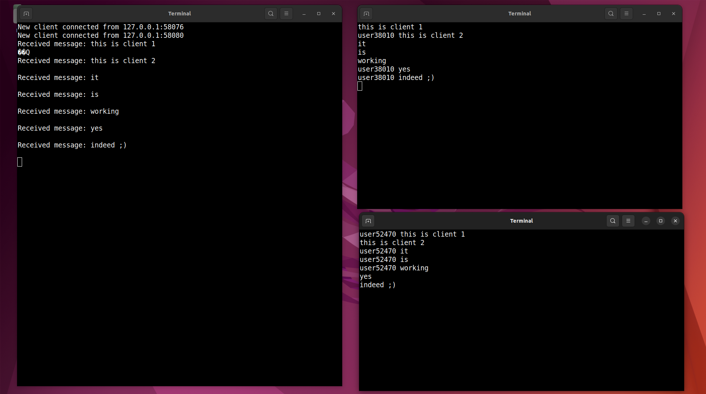

# Updog 🐶: nterminal chat app

## so what's Updog? (gotcha 😆😆)

Updog is a chat app written in c, it can listen to upcoming connections from 1 client and send then receive messages from the client

## Run:

-   use the script:

`mkdir build` if build doesn't exist

then:

server side : `bash ./run.sh -l [port]`

client side: `bash ./run.sh -c [ipAdress] [port]`

or

-   build it manually:

`mkdir build`

`cmake ..`

`make`

`./updog`

## Improvements:

-   [x] start a connection between a server and client
-   [x] send and receive messages
-   [x] allow multiple clients to connect to a server
-   [x] allow user to send multiple messages to the server

### Features:
-   [ ] show the username of the client, and the time when the message was sent
-   [ ] access those rooms with a username and a password
-   [ ] allow file transfer between client and server
-   [ ] secure the file transfer process

### Enhancement:

-   [ ] stop the connection when the client is inactive for 1min

### Todo:
-   [ ] make the user disconnect when he type /q after ensuring the message was sent succesfully (Bug)

❤️you're more than welcome to contribute❤️

### Example:

| :exclamation:  this was tested only on linux  |
|-----------------------------------------|

MIT License
Copyright (c) 2023 duckduckcodes
